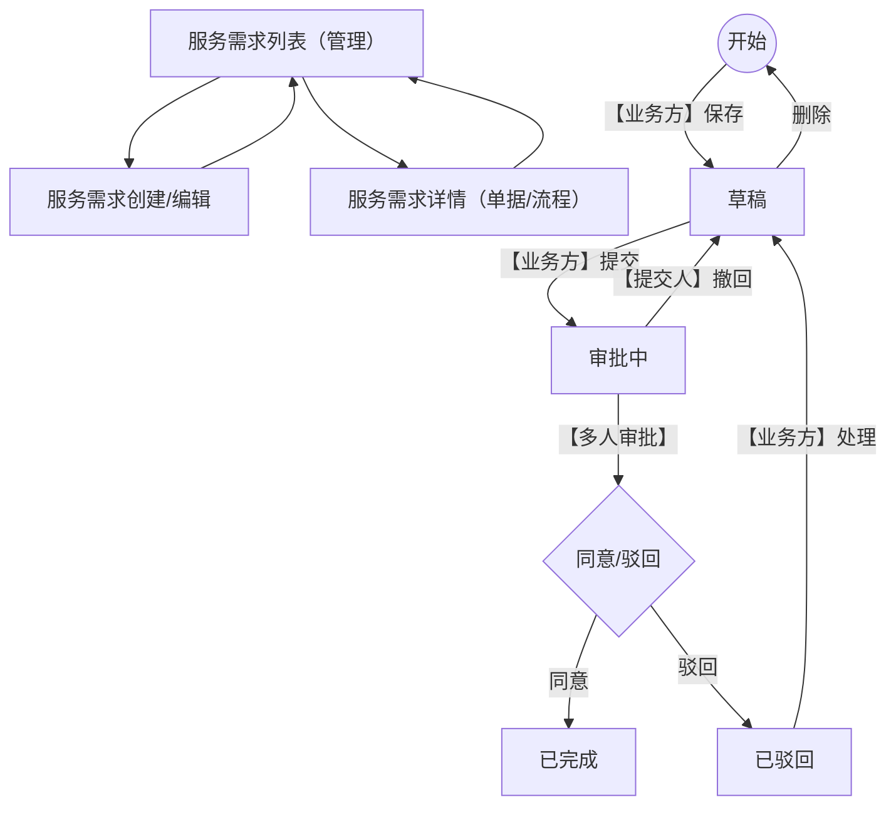

## 1. Product Overview
面向企业内部的“服务需求”线上流转与审批工具。
你可以发起需求、跟踪状态、处理驳回；审批人可在待办中完成同意/驳回。

## 2. Core Features

### 2.1 User Roles
| 角色 | 注册方式 | 核心权限 |
|------|----------|----------|
| 业务方（提交人/发起人） | 不在原型范围（默认已登录） | 创建/保存草稿、提交审批、查看我发起的、处理驳回后再次提交、审批中可撤回 |
| 审批人（多人审批） | 不在原型范围（默认已登录） | 查看我的待办、在详情页进行通过/驳回、查看流转记录 |

### 2.2 Feature Module
我们的服务需求管理需求由以下页面构成：
1. **服务需求列表（管理）**：我的待办/我发起的/我处理的切换、条件查询、列表展示、查看详情、入口创建。
2. **服务需求创建/编辑**：填写基本信息、上传附件、保存草稿、提交。
3. **服务需求详情（单据/流程）**：查看单据字段与附件、查看流程图与流转记录、执行审批动作（通过/驳回/取消）。

### 2.3 Page Details
| Page Name | Module Name | Feature description |
|-----------|-------------|------------------|
| 服务需求列表（管理） | 顶部导航/页签 | 切换「我的待办 / 我发起的 / 我处理的」视图（同一列表不同筛选口径）。 |
| 服务需求列表（管理） | 条件查询区 | 按项目名称、需求编号、需求时间范围、地区公司、部门、项目类型、采购方式进行筛选。 |
| 服务需求列表（管理） | 结果列表 | 展示需求列表的关键信息（如：项目名称、地区公司、采购方式、采购类型、需求时间、状态等）。 |
| 服务需求列表（管理） | 列表操作 | 在每条记录上执行「查看」进入详情页。 |
| 服务需求列表（管理） | 创建入口 | 点击「服务需求创建」进入创建页。 |
| 服务需求列表（管理） | 分页 | 翻页查看更多记录。 |
| 服务需求创建/编辑 | 基本信息表单 | 维护申请单位、申请部门、项目名称、需求时间、资金渠道、采购方式、项目类型、公开选商、是否设控制价、控制价等字段；带必填校验。 |
| 服务需求创建/编辑 | 附件信息 | 按附件类别上传/查看已上传文件（如采购依据、技术方案及批复、采购需求等）。 |
| 服务需求创建/编辑 | 草稿保存 | 点击「保存」将需求保存为草稿状态。 |
| 服务需求创建/编辑 | 提交审批 | 点击「提交」将草稿送入审批中状态。 |
| 服务需求创建/编辑 | 取消返回 | 点击「取消」放弃本次编辑并返回列表（是否保存由实现决定）。 |
| 服务需求详情（单据/流程） | 详情头部 | 展示服务需求编号与当前状态（示例：审批中）。 |
| 服务需求详情（单据/流程） | 详情页签 | 在「单据/流程」间切换查看不同信息。 |
| 服务需求详情（单据） | 单据字段展示 | 以只读方式展示创建页填写的基本信息字段。 |
| 服务需求详情（单据） | 附件展示 | 展示各附件类别下的文件列表与下载入口。 |
| 服务需求详情（流程） | 流程图展示 | 展示当前流程/节点的可视化流程图（原型为图片区域）。 |
| 服务需求详情（流程） | 流转记录 | 展示节点流转明细：节点名称、部门、处理人、节点操作、处理意见、开始时间、结束时间。 |
| 服务需求详情（审批动作） | 通过/驳回/取消 | 审批人在详情页执行「通过」或「驳回」并填写/携带处理意见；「取消」退出操作。 |

## 3. Core Process
### 3.1 业务方（提交人）流程
1) 进入「服务需求列表（管理）」→ 点击「服务需求创建」。
2) 在创建页填写必填信息、上传附件 → 点击「保存」形成草稿。
3) 草稿确认无误 → 点击「提交」进入审批中。
4) 审批中：你可在列表/详情查看状态；如需要中止可「撤回」回到草稿。
5) 若被驳回：你在草稿/驳回态下「处理」修改内容后再次提交。

### 3.2 审批人（多人审批）流程
1) 进入列表页签「我的待办」→ 打开待审批记录「查看」。
2) 在详情页查看单据/附件与流程信息 → 点击「通过」或「驳回」（可填写处理意见）。
3) 处理后在「我处理的」中可追溯记录。

### 3.3 页面导航与状态机（Mermaid）

