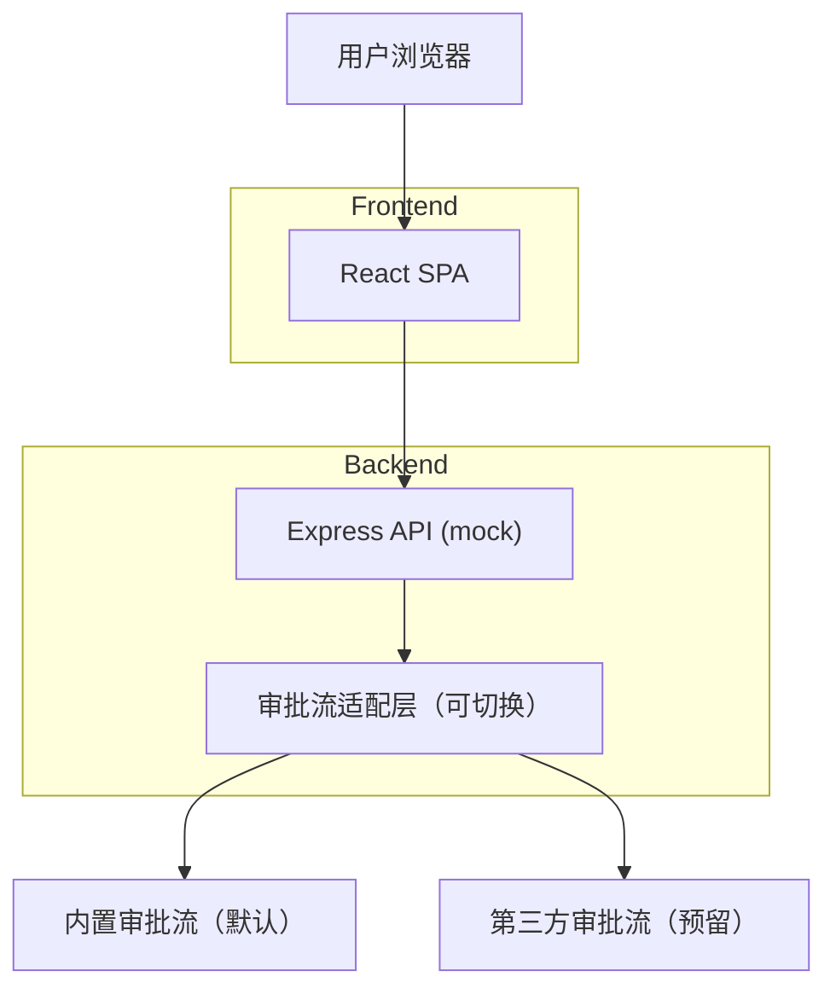
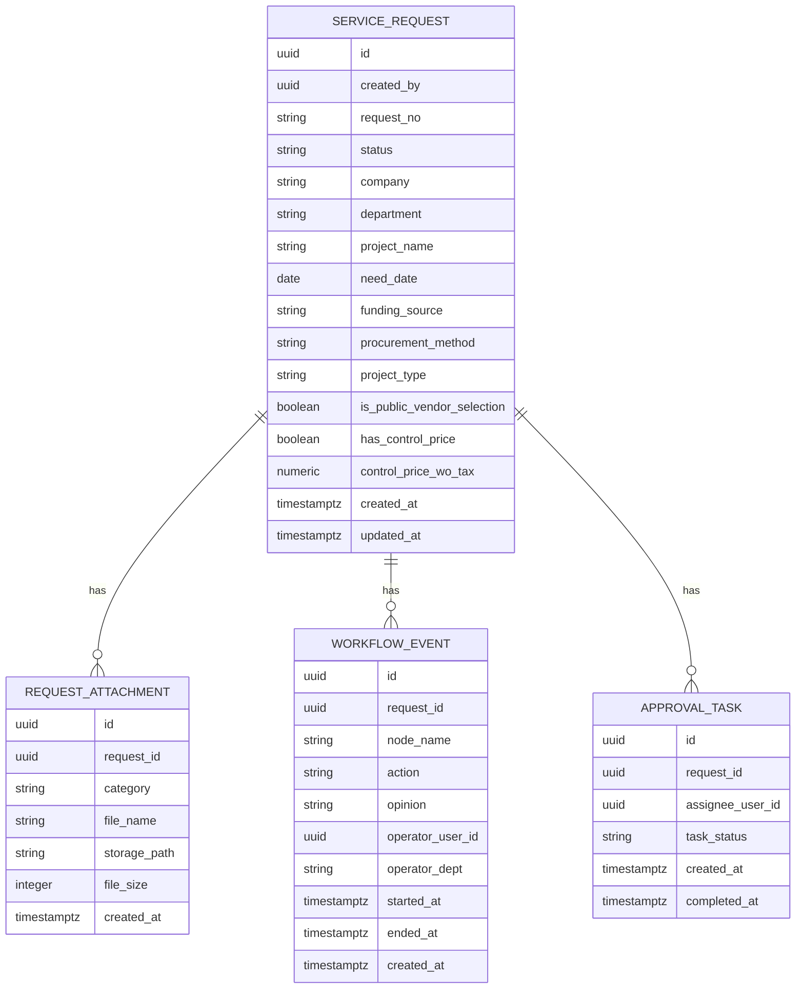

## 1.Architecture design


## 2.Technology Description
- Frontend: React + Vite + TypeScript + TailwindCSS + Zustand + React Router
- Backend: Express (TypeScript, ESM) + 内存/文件 mock 数据（可替换为 Supabase/Postgres）
- Workflow: Adapter Pattern（内置审批流与第三方审批流可切换）

## 3.Route definitions
| Route | Purpose |
|-------|---------|
| / | 默认跳转到我的待办 |
| /todo | 我的待办 |
| /handled | 我处理的 |
| /initiated | 我发起的 |
| /manage | 服务需求管理（全量只读列表） |
| /requests/new | 服务需求创建 |
| /requests/:id | 服务需求详情（单据/流程） |
| /requests/:id/edit | 服务需求编辑（草稿/已驳回后处理） |

## 4.API 设计（mock）
以 REST 为主，所有“状态推进”统一走 transition endpoint，确保状态机与权限在后端也被校验。

| Method | Path | Description |
|--------|------|-------------|
| GET | /api/requests | 列表查询（视图/筛选/分页） |
| GET | /api/requests/:id | 获取单据详情（含状态） |
| POST | /api/requests | 新建草稿（对应“开始 -> 草稿”） |
| PUT | /api/requests/:id | 更新草稿/驳回后草稿（字段不增不减） |
| POST | /api/requests/:id/transition | 状态机动作：submit/withdraw/approve/reject/handle/delete |
| GET | /api/requests/:id/flow | 获取流程记录 |

## 5.状态机与权限校验
- 状态机与按钮控制以同一份规则实现（shared 模块），前后端共享同构规则，避免口径不一致。
- 后端校验优先级：权限 -> 当前状态 -> 动作合法性 -> 字段完整性（提交时）。

## 6.Data model(if applicable)

### 6.1 Data model definition


### 6.2 Data Definition Language
Service Requests（service_requests）
```sql
CREATE TABLE service_requests (
  id UUID PRIMARY KEY DEFAULT gen_random_uuid(),
  created_by UUID NOT NULL,
  request_no VARCHAR(50) UNIQUE NOT NULL,
  status VARCHAR(20) NOT NULL CHECK (status IN ('draft','in_approval','rejected','completed','deleted')),
  company VARCHAR(100) NOT NULL,
  department VARCHAR(100) NOT NULL,
  project_name TEXT NOT NULL,
  need_date DATE NOT NULL,
  funding_source VARCHAR(100) NOT NULL,
  procurement_method VARCHAR(50) NOT NULL,
  project_type VARCHAR(50) NOT NULL,
  is_public_vendor_selection BOOLEAN NOT NULL,
  has_control_price BOOLEAN NOT NULL,
  control_price_wo_tax NUMERIC(14,2),
  created_at TIMESTAMPTZ DEFAULT NOW(),
  updated_at TIMESTAMPTZ DEFAULT NOW()
);

GRANT SELECT ON service_requests TO anon;
GRANT ALL PRIVILEGES ON service_requests TO authenticated;
```

Attachments（request_attachments）
```sql
CREATE TABLE request_attachments (
  id UUID PRIMARY KEY DEFAULT gen_random_uuid(),
  request_id UUID NOT NULL,
  category VARCHAR(50) NOT NULL,
  file_name TEXT NOT NULL,
  storage_path TEXT NOT NULL,
  file_size INTEGER,
  created_at TIMESTAMPTZ DEFAULT NOW()
);

GRANT SELECT ON request_attachments TO anon;
GRANT ALL PRIVILEGES ON request_attachments TO authenticated;
```

Approval Tasks（approval_tasks）
```sql
CREATE TABLE approval_tasks (
  id UUID PRIMARY KEY DEFAULT gen_random_uuid(),
  request_id UUID NOT NULL,
  assignee_user_id UUID NOT NULL,
  task_status VARCHAR(20) NOT NULL CHECK (task_status IN ('pending','completed')),
  created_at TIMESTAMPTZ DEFAULT NOW(),
  completed_at TIMESTAMPTZ
);

GRANT SELECT ON approval_tasks TO anon;
GRANT ALL PRIVILEGES ON approval_tasks TO authenticated;
```

Workflow Events（workflow_events）
```sql
CREATE TABLE workflow_events (
  id UUID PRIMARY KEY DEFAULT gen_random_uuid(),
  request_id UUID NOT NULL,
  node_name VARCHAR(100) NOT NULL,
  action VARCHAR(30) NOT NULL,
  opinion TEXT,
  operator_user_id UUID NOT NULL,
  operator_dept VARCHAR(100),
  started_at TIMESTAMPTZ,
  ended_at TIMESTAMPTZ,
  created_at TIMESTAMPTZ DEFAULT NOW()
);

GRANT SELECT ON workflow_events TO anon;
GRANT ALL PRIVILEGES ON workflow_events TO authenticated;
```

Storage 约定
- Bucket: request-attachments
- storage_path 示例：`{request_id}/{category}/{uuid}_{fileName}`
